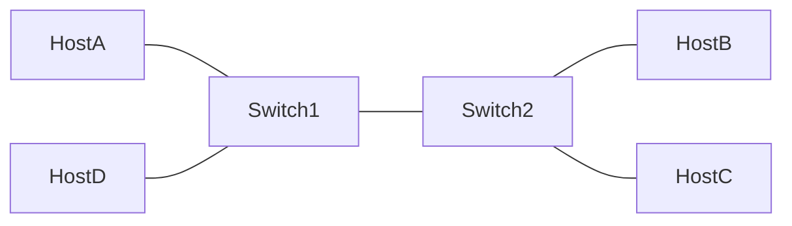

## Overview

By now, you’ve built a TCP-based client-server web application with routers and basic routing functionality. In this comprehensive final project, you will apply what you have learned in CY350 to extend the web application to handle HTTP POST requests, replacing the Go-Back-N protocol for reliable data transfer with Selective Repeat, implementing dynamic routing updates based on topology changes, and designing a Switch class to simulate link-layer services between hosts and routers. You will also incorporate encryption to secure communications. This project will bring together concepts from all layers of the network stack and introduce improved features for both performance and security.

Use your previously written code or use the provided starter files as a starting point; either option is acceptable. When required to write code, you must use Python 3. We highly recommend that you use the programming environment configured in your Windows Subsystem for Linux (WSL) for the course. Since some parts of the project require raw sockets, the code is best run on Linux using administrative privileges as needed, i.e., use `sudo` when required.

The starter repository includes a full implementation of the web application, Go-Back-N protocol, and network described in the instructions for Project 3. It also includes a Switch class that simulates link-layer services.

### Generative AI Use Policy

The use of generative AI tools is __prohibited for the Canvas portion__ of this assignment.

The use of generative AI tools such as ChatGPT or Claude is _authorized_ for the programming portion of this assignment subject to the following restrictions:

- You may only use a generative AI tool that has **study mode*- or the equivelant concept enabled.
    - ChatGPT calls it `Study and learn` mode.
    - Gemini calls it `Guided Learning` mode.
    - VS Code Copilot does not meet this requirement and must be disabled within VSCode before you start writing any code for this project. [Features > Chat > Disable AI Features](vscode://settings/chat.disableAIFeatures)
- You must provide a link to your chat in your DAAW and properly inline cite provided assistance.
    - Recommend that you open your link in an incognito window to verify that it is publicly accessible. If you cannot reach it from an incognito window, your instructor will not be able to access it either.
- You must copy and paste the following prompt as the very first message in any chat on any tool you use:

```txt
Following are the authorized Human-AI teaming (HAT) levels

- HAT Level 1: Support learning of concepts - Focus on explaining concepts, theories, or background knowledge without giving direct solutions.
- HAT Level 2: Collaborate in thinking/reasoning/design - Brainstorm, evaluate, or suggest ideas and options, but do not provide a fully formed solution.

This conversation is for an assignment where you serve as a tutor for me and all responses should be limited to HAT level 1 and HAT level 2.
```

_Failure to follow any of the above restrictions will be considered unauthorized collaboration will result in a significant deduction of points._

### Learning Objectives

- Extending HTTP functionality to support POST requests.
- Implementing cumulative acknowledgements for reliable data transfer.
- Handling dynamic routing updates to adjust to network changes.
- Understanding the role of switches in link-layer services.
- Encrypting and decrypting data to ensure secure communication.

### Points Breakdown

1. Application Layer: Support for POST Requests (50 pts)
2. Transport Layer: Selective Repeat (60 pts)
3. Network Layer: Handling Dynamic Routing Updates (30 pts)
4. Link Layer: Implementing Switches (30 pts)
5. Network Security: Encryption (30 pts)

### Submission Instructions

An autograder will not be used for Project 3. The primary focus of the comprehensive project for CY350 is to assess your knowledge of the networking concepts highlighted above. Therefore, you must submit a written report that describes your approach to accomplishing the tasks (described in detail below) and the results of your efforts.

While this project does not prescribe a specific template or formatting style for your written report, the submission is expected to be professional, well-organized, and clearly written. Your report should present your design decisions, implementation details, testing approach, and results in a manner appropriate for a technical document that you would submit to your commander. Clarity, coherence, and overall presentation will be considered as part of your grade.

## Application Layer: Support for POST Requests

In Project 1, you implemented GET requests. Now, extend your application to support HTTP POST requests, allowing the client to send data to the server.

### Client-Side Modifications

- Modify the client to generate and send HTTP POST requests. The POST request should allow the client to send data (e.g., form data) to the server.

- Example POST request format:
POST /resource HTTP/1.1
Host: <server>
Content-Length: <length of data>
<data>

### Server-Side Modifications

- The server should handle POST requests by receiving the data sent by the client and processing it. Recall that the POST request should result in an update to the resources available to the server. The server should then send an appropriate response back to the client (e.g., confirming the data was received).

### Example POST response

```
HTTP/1.1 200 OK
Content-Type: text/plain

POST request successfully received.
```

1.a. In your report, provide one (1) paragraph describing your approach for implementing POST requests.

1.b. In the next subsection of the report, provide screenshots of the code you implemented to accomplish the task.

1.c. Explain in 1-2 paragraphs how you tested your implementation and provide evidence of its correctness using figures or tables. The presence of flaws in your code is acceptable and will receive full credit so long as you demonstrate a reasonable approach to testing and identify that bugs still exist as well as an explanation for why the code does not function properly.

## Transport Layer: Flow Control

In Project 2, you implemented the Go-Back-N protocol with cumulative acknowledgements. In this project, modify the client to utilize Selective Repeat. Unlike Go-Back-N, where any lost packet forces retransmission of the entire window, Selective Repeat allows the receiver to buffer out-of-order segments and acknowledge each one individually. The sender then retransmits only those specific missing segments. This results in higher efficiency, improved performance in lossy or multi-path environments, and more realistic behavior that begins to resemble the reliability mechanisms used by modern transport protocols. You are provided a `receiver.pyc` compiled python script that implements the receiver side of Selective Repeat. Run `python receiver.pyc` in another terminal to test your implementation of the sender against it.

Required Modifications

- Update the sender to track per-segment timers and retransmit only the segments that have not been acknowledged.

2.a. In your report, provide one or two (1-2) paragraphs describing your approach for implementing Selective Repeat.

2.b. In the next subsection of the report, provide figures with the code you implemented to accomplish the task.

2.c. Explain (in 1-2 paragraphs) how you tested your implementation and provide evidence (in figures or tables) of its correctness. The presence of flaws in your code is acceptable and will receive full credit so long as you demonstrate a reasonable approach to testing and identify that bugs still exist as well as an explanation for why the code does not function properly.

## Network Layer: Handling Dynamic Routing Updates

In Project 2, you implemented basic routing functionality using a link-state algorithm. Now, you need to consider how the router must function when a change to the network topology or link cost occurs. You do not have to implement this functionality, but your report should demonstrate a clear understanding of the necessary changes and how they would work together to handle dynamic routing updates.

3.a. In your report, describe how the Router class will need to be modified to achieve this. Discuss what other classes or components may also need to be modified to support dynamic routing updates.

3.b. In the next subsection of your report, describe your testing approach. Explain how you would simulate a topology change or link cost change.


## Link Layer: Implementing Switches

In this project, you are provided a Switch class to simulate link-layer services. You are also provided a simulation that connects four hosts using two switches. Your task is to implement the learning and forwarding behavior of the switch. The switch should learn the MAC addresses of connected hosts and forward frames based on the destination MAC address. Implement the `forward_frame()` method in the Switch class to achieve this functionality. Additionally, update the `main()` function in `main.py` to show your thorough testing of the switch's learning and forwarding behavior. The provided simulation has the following topology:



4.a. In your report, describe the learning and forwarding behavior of the switch and how you implemented it in the Switch class. Inlcude the total number of print statements you added to the Switch class.

4.b. In the next subsection of your report, discuss your approach to testing the switch's functionality and provide evidence that your implementation is correct. Include screenshots of your updates to main.py to demonstrate the switch's learning and forwarding behavior, as well as screenshots of the output from your tests.

## Network Security: Encryption

To secure data transmission, implement encryption at HTTP server and decryption at the HTTP client. All response data transmitted between the server and client should be encrypted via symmetric encryption to ensure confidentiality.

Hint: Use the cryptography library for python. You should perform this task last so you can continue to see the payload in plaintext for troubleshooting the other tasks.

Restriction:

- You may not use the Fernet algorithm.

Server-Side Modifications

- Implement encryption for the payload of outgoing packets (response) before sending them.

Client-Side Modifications

- Implement decryption for the payload of incoming packets (response).

5.a. In the project report, explain your choice for encryption type.

5.b. In the next subsection of the report, provide figures with the code you implemented to
accomplish the task.

5.c. Explain (in 1-2 paragraphs) how you tested your implementation and provide evidence (in figures or tables) of its correctness. The presence of flaws in your code is acceptable and will receive full credit so long as you demonstrate a reasonable approach to testing and identify that bugs still exist.
